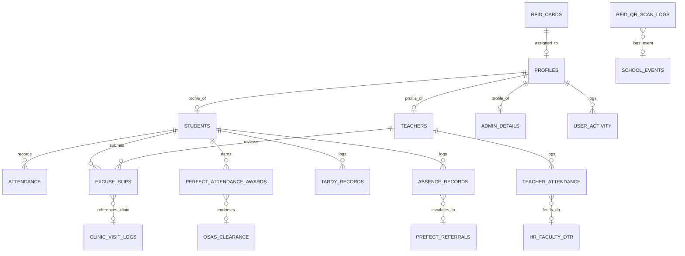

# Database & Schema Design Skill (SMS1-AMS)

## Goal

Design, optimize, and maintain a robust, normalized, and strictly secured **Supabase PostgreSQL** database architecture for the Bestlink College of the Philippines Attendance Monitoring System (AMS), including schema bridges connecting AMS with the wider SMS 1 ecosystem.

---

## 1. Database Standards & Golden Rules

1. **Schema Authority:** All database structures must strictly align with `docs/database/database_schema_design.md` and `docs/database/supabase_schema.sql`.
2. **Never Invent Phantom Tables:** Work exclusively with confirmed tables:
   * **Core Master Directory:** `profiles`, `students`, `teachers`, `admin_details`, `academic_calendar`
   * **Attendance Records:** `attendance`, `teacher_attendance`, `rfid_qr_scan_logs`
   * **Truancy & Exceptions:** `tardy_records`, `absence_records`, `excuse_slips`, `excuse_attachments`
   * **Hardware & Alerts:** `rfid_cards`, `qr_codes`, `parent_alerts`, `sms_logs`
   * **Honors & Workflow:** `perfect_attendance_awards`, `user_activity`
3. **100% Row Level Security (RLS):** Every table MUST execute `ALTER TABLE <table_name> ENABLE ROW LEVEL SECURITY;`.
4. **Primary Identity Mapping:** `profiles.id` maps 1:1 with Supabase Auth `auth.users.id` via `ON DELETE CASCADE`.
5. **Non-Destructive Migrations:** Never drop tables or execute unvetted destructive SQL. Always provide non-destructive migration scripts (`ADD COLUMN IF NOT EXISTS`).

---

## 2. Entity & Table Blueprint (AMS Core & SMS 1 Bridges)



### High-Performance Scan Indexes
* `idx_students_rfid` on `students(rfid_uid)`
* `idx_students_qr` on `students(qr_code)`
* `idx_attendance_date` on `attendance(date)`
* `idx_attendance_student_id` on `attendance(student_id)`
* `idx_rfid_uid` on `rfid_cards(card_uid)`
* `idx_scan_logs_timestamp` on `rfid_qr_scan_logs(scan_timestamp)`

---

## 3. SMS 1 Cross-Module Bridge Columns

To maintain seamless interoperability across the SMS 1 master architecture:

```sql
-- 1. Bridge to Clinic Management (Medical Excuse Verification)
ALTER TABLE excuse_slips ADD COLUMN IF NOT EXISTS medical_source VARCHAR(30) DEFAULT 'EXTERNAL_MEDICAL';
ALTER TABLE excuse_slips ADD COLUMN IF NOT EXISTS clinic_visit_id UUID;
ALTER TABLE excuse_slips ADD COLUMN IF NOT EXISTS clinic_pass_number VARCHAR(50);
ALTER TABLE excuse_slips ADD COLUMN IF NOT EXISTS clinic_verification_status VARCHAR(20) DEFAULT 'NOT_APPLICABLE';

-- 2. Bridge to PREFECT Disciplinary Action (Habitual Truancy Escalation)
ALTER TABLE absence_records ADD COLUMN IF NOT EXISTS is_habitual_truancy BOOLEAN DEFAULT false;
ALTER TABLE absence_records ADD COLUMN IF NOT EXISTS prefect_referral_id UUID;
ALTER TABLE tardy_records ADD COLUMN IF NOT EXISTS prefect_referral_id UUID;

-- 3. Bridge to Academic HR Management (Faculty DTR & Leave Sync)
ALTER TABLE teacher_attendance ADD COLUMN IF NOT EXISTS employee_id VARCHAR(50);
ALTER TABLE teacher_attendance ADD COLUMN IF NOT EXISTS rendered_hours DECIMAL(4,2);
ALTER TABLE teacher_attendance ADD COLUMN IF NOT EXISTS hr_leave_id UUID;
ALTER TABLE teacher_attendance ADD COLUMN IF NOT EXISTS hr_sync_status VARCHAR(20) DEFAULT 'SYNCED';

-- 4. Bridge to OSAS (Perfect Attendance Honors Endorsement)
ALTER TABLE perfect_attendance_awards ADD COLUMN IF NOT EXISTS osas_endorsement_status VARCHAR(20) DEFAULT 'PENDING_OSAS';
ALTER TABLE perfect_attendance_awards ADD COLUMN IF NOT EXISTS certificate_serial_hash VARCHAR(64) UNIQUE;

-- 5. Bridge to School Events Management (Campus Event Scanning)
ALTER TABLE rfid_qr_scan_logs ADD COLUMN IF NOT EXISTS event_id UUID;
ALTER TABLE rfid_qr_scan_logs ADD COLUMN IF NOT EXISTS scan_context VARCHAR(30) DEFAULT 'CLASSROOM_PERIOD';
```

---

## 4. Row Level Security (RLS) Policy Matrix

| Table | Student RLS Policy | Teacher RLS Policy | Admin RLS Policy |
| :--- | :--- | :--- | :--- |
| `profiles` | `SELECT` own (`auth.uid() = id`) | `SELECT` own + assigned students | Full `ALL` |
| `students` | `SELECT` own (`user_id = auth.uid()`) | `SELECT` assigned class sections | Full `ALL` |
| `teachers` | `SELECT` basic directory info | `SELECT` own record | Full `ALL` |
| `attendance` | **`SELECT` ONLY** own records | `SELECT`, `INSERT`, `UPDATE` class | Full `ALL` + Override |
| `teacher_attendance` | **NO ACCESS** | `SELECT` own DTR logs | Full `ALL` (HR oversight) |
| `excuse_slips` | `SELECT`, `INSERT` own slips | `SELECT`, `UPDATE` (approve/reject) | Full `ALL` (Appeals) |
| `perfect_attendance_awards` | `SELECT` own award records | `SELECT`, `INSERT` (nominees) | Full `ALL` (Conferment) |
| `rfid_qr_scan_logs` | **NO ACCESS** (Security) | `SELECT`, `INSERT` classroom scans | Full `ALL` |
| `user_activity` | **NO ACCESS** | **NO ACCESS** | `SELECT` ONLY (Immutable) |

---

## 5. Review & Migration Workflow

When planning or proposing database modifications:

1. **Analyze Existing Schema:** Check `docs/database/database_schema_design.md` to prevent column redundancy or key conflicts.
2. **Define Referential Integrity:** Specify foreign key behaviors (`ON DELETE CASCADE` vs `ON DELETE SET NULL`).
3. **Plan RLS Impact:** Detail explicit PostgreSQL RLS policies for each role before writing DDL.
4. **Generate Non-Destructive SQL:** Use `CREATE TABLE IF NOT EXISTS`, `ALTER TABLE ... ADD COLUMN IF NOT EXISTS`, and safe indexes.
5. **Update Setup Scripts:** Ensure changes are documented in `docs/database/supabase_schema.sql`.
