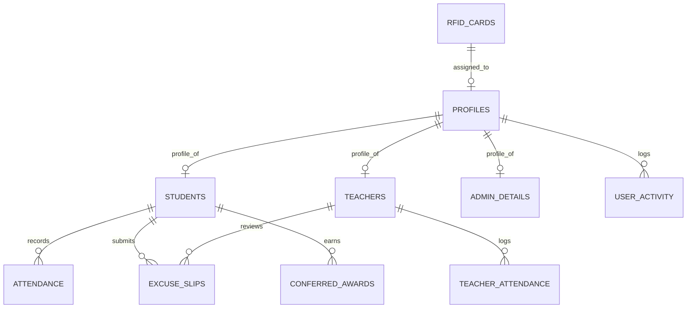

---

name: database
description: Design, review, and document Supabase PostgreSQL schemas, relationships, SQL planning, normalization, and Row Level Security for the attendance monitoring system. Use when working with database design or Supabase.
----------------------------------------------------------------------------------------------------------------------------------------------------------------------------------------------------------------------------------

# Database & Schema Design Skill (SMS1-AMS)

## Goal

Design, optimize, and maintain a robust, normalized, and strictly secured **Supabase PostgreSQL** database architecture for the Bestlink College of the Philippines Attendance Monitoring System.

---

## 1. Database Standards & Golden Rules

1. **Schema Authority:** All database structures must strictly align with [`docs/database_schema_design.md`](file:///c:/Users/jaync/Desktop/Attendance%20Monitoring/SMS1-AMS/docs/database_schema_design.md) and [`docs/supabase_schema_setup.sql`](file:///c:/Users/jaync/Desktop/Attendance%20Monitoring/SMS1-AMS/docs/supabase_schema_setup.sql).
2. **Never Invent Phantom Tables:** Work exclusively with confirmed tables:
   * Core: `profiles`, `students`, `teachers`, `admin_details`
   * Attendance: `attendance`, `teacher_attendance`
   * Hardware & Comms: `rfid_cards`, `sms_logs`
   * Workflow & Honors: `excuse_slips`, `conferred_awards`
   * Security & Audit: `user_activity`
3. **100% Row Level Security (RLS):** Every table MUST execute `ALTER TABLE <table_name> ENABLE ROW LEVEL SECURITY;`.
4. **Primary Identity Mapping:** `profiles.id` maps 1:1 with Supabase Auth `auth.users.id` via `ON DELETE CASCADE`.
5. **No Destructive Operations:** Never drop tables or execute unvetted destructive SQL. Always provide non-destructive migration scripts (`ADD COLUMN IF NOT EXISTS`).

---

## 2. Entity & Table Blueprint

### Key Performance Indexes:
* **High-Frequency Scan Lookups:**
  * `idx_students_rfid` on `students(rfid_uid)`
  * `idx_students_qr` on `students(qr_code)`
  * `idx_attendance_date` on `attendance(date)`
  * `idx_attendance_student_id` on `attendance(student_id)`
  * `idx_rfid_uid` on `rfid_cards(card_uid)`

---

## 3. Row Level Security (RLS) Policy Matrix

| Table | Student RLS Policy | Teacher RLS Policy | Admin RLS Policy |
| :--- | :--- | :--- | :--- |
| `profiles` | `SELECT` own (`auth.uid() = id`) | `SELECT` own + assigned students | Full `ALL` |
| `students` | `SELECT` own (`user_id = auth.uid()`) | `SELECT` assigned class sections | Full `ALL` |
| `teachers` | `SELECT` basic directory info | `SELECT` own record | Full `ALL` |
| `attendance` | **`SELECT` ONLY** own records | `SELECT`, `INSERT`, `UPDATE` class | Full `ALL` + Override |
| `teacher_attendance` | **NO ACCESS** | `SELECT` own DTR logs | Full `ALL` (HR oversight) |
| `excuse_slips` | `SELECT`, `INSERT` own slips | `SELECT`, `UPDATE` (approve/reject) | Full `ALL` (Appeals) |
| `conferred_awards` | `SELECT` own award records | `SELECT`, `INSERT` (nominees) | Full `ALL` (Conferment) |
| `user_activity` | **NO ACCESS** | **NO ACCESS** | `SELECT` ONLY (Immutable) |

---

## 4. Review & Migration Workflow

When planning or proposing database modifications:

1. **Analyze Existing Schema:** Check [`docs/database_schema_design.md`](file:///c:/Users/jaync/Desktop/Attendance%20Monitoring/SMS1-AMS/docs/database_schema_design.md) to prevent column redundancy or key conflicts.
2. **Define Referential Integrity:** Specify foreign key behaviors (`ON DELETE CASCADE` vs `ON DELETE SET NULL`).
3. **Plan RLS Impact:** Detail explicit PostgreSQL RLS policies for each role before writing DDL.
4. **Generate Non-Destructive SQL:** Use `CREATE TABLE IF NOT EXISTS`, `ALTER TABLE ... ADD COLUMN IF NOT EXISTS`, and safe indexes.
5. **Update Setup Scripts:** Ensure changes are documented in [`docs/supabase_schema_setup.sql`](file:///c:/Users/jaync/Desktop/Attendance%20Monitoring/SMS1-AMS/docs/supabase_schema_setup.sql).

---

## 5. Required Output Format

1. **Entity Analysis:** Purpose of table/field and business logic rationale.
2. **Schema Definition Table:** Column names, PostgreSQL data types, and constraints.
3. **SQL Migration Script:** Complete, executable PostgreSQL DDL statements.
4. **RLS Policy Definitions:** Concrete SQL policies enforcing role security.
5. **Verification & Testing Queries:** Queries to test authorized vs unauthorized access.
6. **Rollback Plan:** Safe rollback instructions in case of deployment issues.
