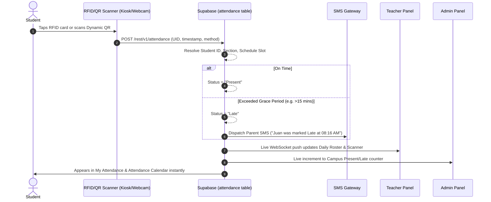
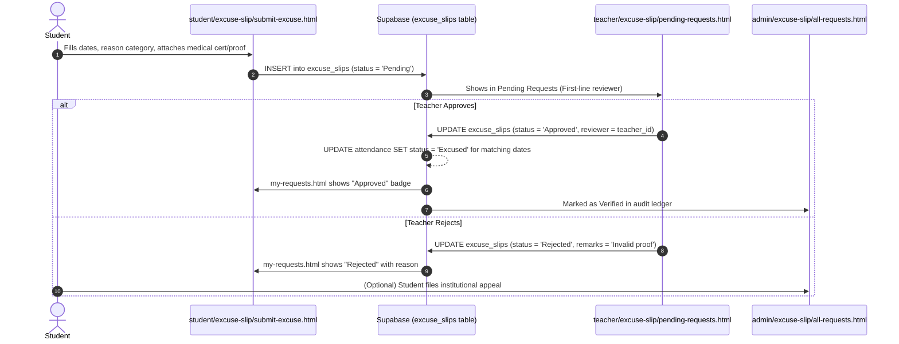
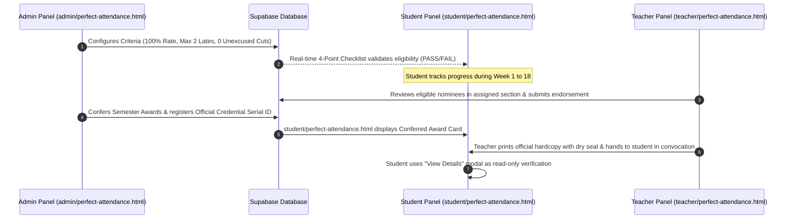
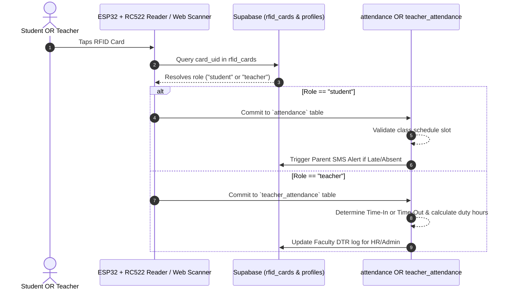

---

name: system-flow
description: End-to-end system flows, cross-panel module connections, database table mappings, and lifecycles linking Admin, Teacher, and Student roles in the Bestlink College of the Philippines Attendance Monitoring System. Use when connecting modules, verifying data consistency, or validating that all roles are properly wired together.
---------------------------------------------------------------------------------------------------------------------------------------------------------------------------------------------------------------------------------------------------------------------------------------------------------------------------------------------------------------------------------

# End-to-End System Flow Skill (SMS1-AMS)

## Goal

Provide a definitive, unified map of the entire attendance monitoring system so developers and AI agents understand how data flows across **Admin**, **Teacher**, and **Student** panels. This eliminates guesswork, prevents orphaned modules, and ensures every feature is connected end-to-end.

---

## 1. High-Level System Architecture & Flow Map

```
  ┌─────────────────────────────────────────────────────────────────────────────┐
  │                           SYSTEM LIFECYCLE OVERVIEW                         │
  └─────────────────────────────────────────────────────────────────────────────┘

  [1. PROVISIONING & SETUP]
       Admin creates Users (Students/Teachers), Assigns RFID UIDs & QR Codes, 
       Configures Academic Terms, Sections, and Schedules.
                                      │
                                      ▼
  [2. ATTENDANCE CAPTURE]
       Student/Teacher scans via ESP32 IoT RFID or Web Camera QR Scanner.
       Teacher conducts Daily Attendance roster & submits session to Admin.
                                      │
                                      ▼
  [3. DATABASE COMMIT & AUTOMATION]
       Supabase PostgreSQL commits record -> triggers Parent SMS Alert -> 
       updates daily tallies (Present, Late, Absent, Excused).
                                      │
                                      ▼
  [4. CROSS-PANEL DATA REFLECTION]
       ├─► STUDENT: Sees personal record in My Attendance, Calendar, & Notifications.
       ├─► TEACHER: Sees updated class roster, tardy tallies, & faculty DTR hours.
       └─► ADMIN: Sees campus-wide counters, kiosk scan logs, & audit trail.
                                      │
                                      ▼
  [5. EXCEPTIONS & ADJUSTMENTS (EXCUSE SLIPS)]
       Student files Excuse Slip with proof -> Teacher verifies (First Line) -> 
       Admin audits/approves (Final) -> Attendance status auto-updates to "Excused".
                                      │
                                      ▼
  [6. ANALYTICS & HONORS CONFERMENT]
       Attendance rates aggregated -> Performance Analytics updated across roles -> 
       Perfect Attendance candidates flagged -> Teachers endorse -> Admin confers -> 
       Student views official award verification record.
```

---

## 2. Cross-Panel Module Connection Matrix

Every page in the system corresponds to complementary views in the other panels:

| Domain / Lifecycle | Admin Panel (`admin/`) | Teacher Panel (`teacher/`) | Student Panel (`student/`) | Shared Supabase Table(s) |
| :--- | :--- | :--- | :--- | :--- |
| **Authentication & Profile** | `profile.html` | `profile.html` | `profile.html` | `profiles`, `admin_details`, `teachers`, `students` |
| **Dashboard** | `dashboard.html` (Campus-wide) | `dashboard.html` (Assigned classes) | `dashboard.html` (Personal) | View aggregates, `attendance`, `excuse_slips` |
| **Daily Attendance** | `attendance.html` (Audit & Override) | `daily-attendance.html` (Class Roster & Submit) | `my-attendance.html` (Personal Log) | `attendance`, `classes`, `schedules` |
| **Calendar View** | `attendance-calendar.html` (Institution-wide) | `attendance-calendar.html` (Class Schedule Calendar) | `attendance-calendar.html` (Personal Attendance Grid) | `attendance`, `academic_calendar` |
| **Hardware RFID & QR** | `rfid-and-qr/rfid-registry.html`, `qr-management.html` | `rfid-and-qr/live-scanner.html`, `scan-logs.html` | `rfid-and-qr.html` (View ID / Dynamic QR) | `rfid_cards`, `qr_codes`, `scan_logs` |
| **Tardy Records** | `tardy-and-absence/tardy-list.html` (Chronic tardy alerts) | `tardy-and-absence/tardy-list.html` (Subject late list) | `tardy-and-absence/tardy-records.html` (Delay breakdown) | `attendance`, `tardy_logs` |
| **Absence Records** | `tardy-and-absence/absence-list.html` (Habitual offender list) | `tardy-and-absence/absence-list.html` (Subject absences) | `tardy-and-absence/absence-records.html` (Risk tracker) | `attendance`, `absence_records` |
| **Attendance History** | `attendance.html` (All filters) | `tardy-and-absence/student-attendance-history.html` | `tardy-and-absence/attendance-history.html` | `attendance` |
| **Excuse Slips** | `excuse-slip/all-requests.html` (Final review & appeals) | `excuse-slip/pending-requests.html` (Classroom approval) | `excuse-slip/submit-excuse.html`, `my-requests.html` | `excuse_slips`, `excuse_attachments` |
| **Faculty Attendance** | `teacher-attendance.html` (HR/Campus DTR) | `teacher-attendance.html` (Personal Faculty DTR) | *N/A (Students do not track faculty)* | `teacher_attendance` |
| **Analytics** | `performance-analytics.html` (Campus trends) | `class-analytics.html` (Section performance) | `performance-analytics.html` (Personal metrics) | Aggregates from `attendance` |
| **Perfect Attendance** | `perfect-attendance.html` (Conferment & threshold setup) | `perfect-attendance.html` (Nominee review & endorsement) | `perfect-attendance.html` (Eligibility & Award Record) | `award_nominations`, `conferred_awards` |
| **Parent Alerts** | `parent-alerts.html` (SMS gateway logs) | *Triggered automatically on Late/Absent* | `notifications.html` (Read-only alert feed) | `sms_logs`, `notifications` |

---

## 3. Detailed End-to-End Workflows

### Flow A: Attendance Capture & Multi-Panel Sync



* **Data Consistency Rule**: If a student is marked "Late" on `teacher/daily-attendance.html`, `student/tardy-and-absence/tardy-records.html` must increment immediately, and `admin/tardy-and-absence/tardy-list.html` must reflect the occurrence.

---

### Flow B: Excuse Slip Submission & Multi-Level Review



* **Data Consistency Rule**: Approving an excuse slip **must** mutate the corresponding `attendance.status` from `Absent` to `Excused`. This automatically updates:
  - `student/my-attendance.html` (Status changes to Excused).
  - `student/attendance-calendar.html` (Date badge turns Blue).
  - `student/perfect-attendance.html` (Unexcused count decreases, eligibility preserved).
  - `teacher/daily-attendance.html` (Status displays Excused).
  - `admin/attendance.html` (Reflects approved excuse with audit remarks).

---

### Flow C: Perfect Attendance Award Nomination & Conferment



* **Data Consistency Rule**:
  - `admin/perfect-attendance.html` = Criteria Authority & Final Conferment.
  - `teacher/perfect-attendance.html` = Section Evaluator & Endorser.
  - `student/perfect-attendance.html` = Read-Only Candidate Tracker & Verification Ledger (no self-printing).

---

### Flow D: Unified Hardware RFID/QR & Role Resolution Flow



---

## 4. End-to-End Checklist for Developers & Agents

Before implementing or connecting any module, verify:

1. **Upstream Source Identified**: Where does the initial data come from? (e.g., RFID tap, teacher manual entry, student request).
2. **Database Commit Verified**: What table stores this? (`attendance`, `excuse_slips`, `rfid_cards`, `teacher_attendance`).
3. **Downstream Reflection Checked**:
   - [ ] Does it update the **Student** view?
   - [ ] Does it update the **Teacher** view?
   - [ ] Does it update the **Admin** view?
4. **Role Permissions Respected**:
   - [ ] Is the Student strictly read-only where appropriate?
   - [ ] Does the Teacher have access only to their assigned sections?
   - [ ] Does the Admin have global audit and override rights?
5. **UI Consistency**: Does the new or connected page adhere to `.agent/skills/ui-ux/SKILL.md`?
