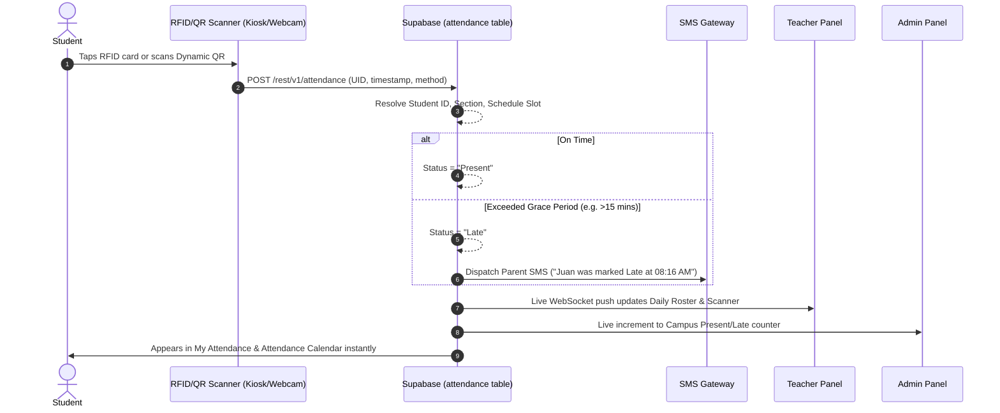
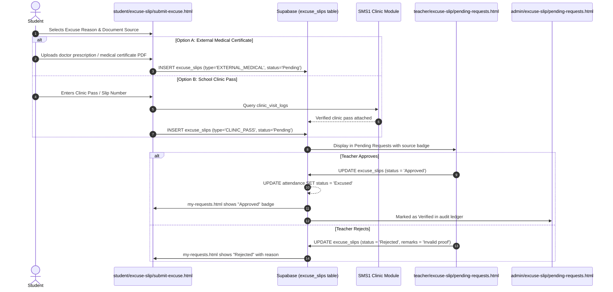
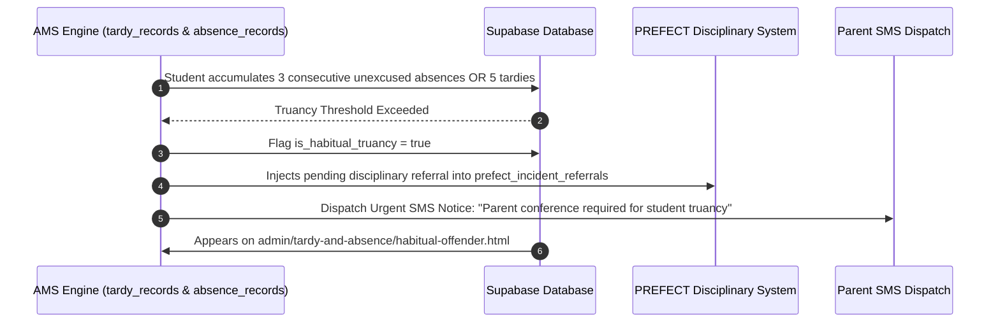

# End-to-End System Flow Skill (SMS1-AMS)

## Goal

Provide a definitive, unified map of the entire attendance monitoring system so developers and AI agents understand how data flows across **Admin**, **Teacher**, and **Student** panels, and how AMS connects with the 5 companion systems in the SMS 1 master architecture. This eliminates guesswork, prevents orphaned modules, and ensures every feature is connected end-to-end.

---

## 1. High-Level System Architecture & Flow Map

```
  ┌─────────────────────────────────────────────────────────────────────────────┐
  │                           SYSTEM LIFECYCLE OVERVIEW                         │
  └─────────────────────────────────────────────────────────────────────────────┘

  [1. PROVISIONING & MASTER DIRECTORY (SMS 1 SHARED LAYER)]
       Shared SMS 1 directory provisions Users (Students/Teachers), RFID UIDs, 
       QR Code hashes, and the Academic Calendar (Semesters, Terms, Holidays).
                                      │
                                      ▼
  [2. ATTENDANCE CAPTURE (AMS CORE)]
       Student/Teacher taps via ESP32 IoT RFID or Web Camera QR Scanner.
       Teacher conducts Daily Attendance roster & submits session.
       Scanner supports dual context: Classroom check-in vs. Campus Event check-in.
                                      │
                                      ▼
  [3. DATABASE COMMIT & REAL-TIME DISPATCH]
       Supabase PostgreSQL commits record -> triggers automated Parent SMS Alert -> 
       updates daily tallies (Present, Late, Absent, Excused).
                                      │
                                      ▼
  [4. CROSS-PANEL DATA REFLECTION]
       ├─► STUDENT: Sees personal record in My Attendance, Calendar, & Notifications.
       ├─► TEACHER: Sees updated class roster, tardy tallies, & faculty DTR hours.
       └─► ADMIN: Sees campus-wide counters, kiosk scan logs, & audit trail.
                                      │
                                      ▼
  [5. EXCEPTIONS & ADJUSTMENTS (DUAL-OPTION EXCUSE SLIPS)]
       Student submits excuse slip:
       - Option A: External medical certificate / doctor prescription upload.
       - Option B: Campus Clinic Pass reference with automatic clinic verification.
       Teacher verifies (First Line) -> Admin audits/approves (Final) -> 
       Status auto-updates to "Excused".
                                      │
                                      ▼
  [6. SMS 1 CROSS-MODULE DOWNSTREAM INTEGRATION]
       ├─► CLINIC: Receives verified medical excuses & bed rest attendance status.
       ├─► PREFECT: Receives automated Habitual Truancy escalations (>3 absences / >5 lates).
       ├─► ACADEMIC HR: Receives Faculty DTR logs & RFID gate entry/exit hours.
       ├─► OSAS: Receives Perfect Attendance candidates for graduation clearance & convocation.
       └─► SCHOOL EVENTS: Receives real-time attendee headcounts from event kiosk scans.
                                      │
                                      ▼
  [7. UNIVERSAL TABLE-LEVEL EXPORTS & MULTI-FORMAT MODAL (CHED COMPLIANT)]
        All operational tables provide direct data extraction via export-modal.js.
        Outputs include CSV, EXCEL (.xlsx), PDF (Printable CHED Collegiate Sheet),
        and WORD (.doc) with official academic department, course, and signatory metadata.
```

---

## 2. Cross-Panel 9-Core-Submodule Connection Matrix

Every page in the system corresponds to complementary views in the other panels matching the **10 Official Submodules**:

| Submodule # | Official Submodule Name | Admin Portal (`admin/`) | Teacher Portal (`teacher/`) | Student Portal (`student/`) | Shared Supabase Table(s) |
| :---: | :--- | :--- | :--- | :--- | :--- |
| **8** | **Analytics Dashboard** | `dashboard.html`, `performance-analytics.html` | `dashboard.html`, `class-analytics.html` | `dashboard.html`, `performance-analytics.html` | Daily view aggregates, `attendance`, `excuse_slips` |
| **1** | **Daily Attendance Marking** | `attendance.html` (Campus audit & override) | `daily-attendance.html` (Class roster & batch submit) | `my-attendance.html` (Personal subject log) | `attendance`, `classes`, `schedules` |
| **2** | **RFID / QR Scanning** | `rfid-and-qr/rfid-registry.html`, `qr-management.html`, `scan-logs.html`, `device-management.html` | `rfid-and-qr/live-scanner.html` (Classroom/Event kiosk), `scan-logs.html` | `rfid-and-qr.html` (Dynamic QR badge & card UID) | `rfid_cards`, `qr_codes`, `scan_logs`, `hardware_devices` |
| **3** | **Tardy & Absence Logs** | `tardy-and-absence/tardy-list.html`, `absence-list.html`, `habitual-offender.html` | `tardy-and-absence/tardy-list.html`, `absence-list.html` | `tardy-and-absence/tardy-records.html`, `absence-records.html` | `attendance`, `tardy_records`, `absence_records` |
| **4** | **Teacher Attendance** | `teacher-attendance.html` (HR campus DTR) | `teacher-attendance.html` (Personal faculty DTR) | *N/A (Staff-only)* | `teacher_attendance` |
| **5** | **Excuse Slip Submission** | `excuse-slip/pending-requests.html`, `approved-requests.html`, `rejected-requests.html` | `excuse-slip/pending-requests.html`, `approved-requests.html` | `excuse-slip/submit-excuse.html` (Dual medical option), `my-requests.html` | `excuse_slips`, `excuse_attachments` |
| **6** | **Attendance Calendar** | `attendance-calendar.html` (Institutional schedule) | `attendance-calendar.html` (Class schedule calendar) | `attendance-calendar.html` (Personal presence heatmap) | `attendance`, `academic_calendar` |
| **7** | **Alerts to Parents** | `parent-alerts.html` (SMS dispatch queue & log) | `parent-alerts.html` (Classroom absence notification log) | `notifications.html` (Read-only alert feed) | `parent_alerts`, `sms_logs` |
| **9** | **Perfect Attendance** | `perfect-attendance.html` (Threshold setup & conferment) | `perfect-attendance.html` (Section nominee review & endorsement) | `perfect-attendance.html` (Eligibility criteria checklist & certificate) | `perfect_attendance_awards` |
| **Service** | **Table-Level Multi-Format Export** | Contextual Export buttons across all tables (`export-modal.js` - CSV, EXCEL, PDF, WORD with CHED compliance) | Contextual Export buttons across all tables (`export-modal.js` - CSV, EXCEL, PDF, WORD with CHED compliance) | Personal attendance and request export buttons (`export-modal.js`) | Direct tabular data extraction from active dataset |
| **Gov** | **System Audit & Governance** | `audit-logs.html` (Mutation ledger & diff inspection) | *N/A (Admin only)* | *N/A (Admin only)* | `user_activity` |

*Note: `academic-management.html` is permanently excluded from AMS navigation as curriculum management resides upstream in SMS 1 Academic Module.*

---

## 3. SMS 1 Master Architecture Integration Bridges

AMS maintains 5 standardized data bridges connecting to the wider SMS 1 ecosystem:

### Bridge 1: Clinic Management System
* **Data Flow**: When student submits a medical excuse slip with "Campus Clinic Pass", AMS queries `clinic_visit_logs`.
* **Action**: Verifies clinic admission timestamp against class schedule. Automatically assigns status `Excused (Clinic Verified)`.

### Bridge 2: PREFECT Disciplinary Action System
* **Data Flow**: When `absence_records` reaches 3 consecutive cuts or `tardy_records` exceeds 5 instances in a term, AMS sets `is_habitual_truancy = true`.
* **Action**: Injects record into `prefect_incident_referrals` table with student ID, section, and violation summary for parent summon.

### Bridge 3: Academic HR Management System
* **Data Flow**: Faculty RFID gate entries and teaching room check-ins committed to `teacher_attendance`.
* **Action**: Feeds `hr_faculty_dtr` daily. Deducts undertime from payroll records or checks approved leaves in `hr_leave_applications`.

### Bridge 4: OSAS (Office of Student Affairs and Services)
* **Data Flow**: Submodule 9 compiles students maintaining 100% attendance and zero unexcused cuts into `perfect_attendance_qualifiers`.
* **Action**: OSAS endorses recipients for honors convocation and clears student conduct status for graduation clearance.

### Bridge 5: School Event Management System
* **Data Flow**: Submodule 2 (`live-scanner.html`) toggles `scan_context = 'EVENT_VENUE'` referencing `school_events.id`.
* **Action**: Logs event attendee check-in and provides real-time headcounts to event organizers.

---

## 4. Detailed End-to-End Workflows

### Flow A: Attendance Capture & Multi-Panel Sync



---

### Flow B: Dual-Option Excuse Slip Submission & Review



---

### Flow C: Habitual Truancy Escalation to PREFECT



---

## 5. End-to-End Quality Checklist

Before submitting code or documentation changes:

1. **Strict 10-Submodule Mapping:** Does the feature align with the 10 official submodules?
2. **Zero Table-Level Export Clutter:** Are all table-level export buttons eliminated in favor of Submodule 10?
3. **Dual Medical Excuse Compatibility:** Can the module handle both external medical uploads and clinic passes?
4. **SMS 1 Bridge Compliance:** Are the relevant foreign keys and payload shapes referenced accurately?
5. **No Academic-Management Navigation:** Is `academic-management.html` absent from AMS menus?
6. **Cross-Panel Reflection:** Does an action taken by a teacher or student immediately reflect across Admin and Student views?
