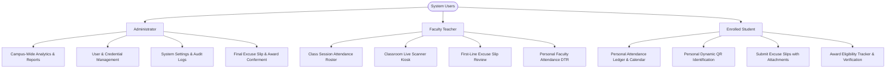
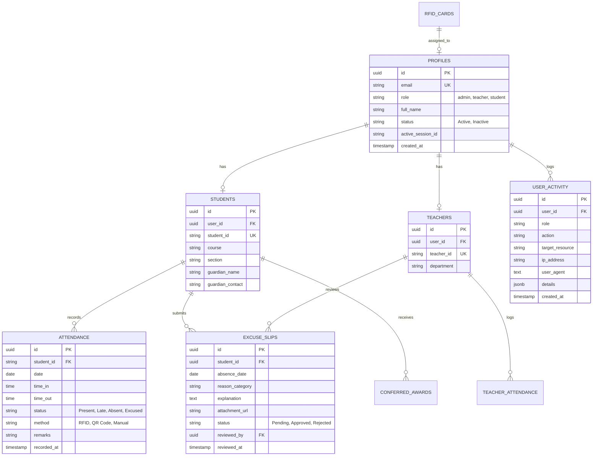

# Product Requirements Document (PRD)

## Project Title
**Design and Development of an Attendance Monitoring System for Bestlink College of the Philippines with Performance Analytics and RFID/QR Scanning (SMS1-AMS)**

---

## 1. Document Control & Metadata
* **Institution:** Bestlink College of the Philippines (BCP)
* **Program:** Bachelor of Science in Information Technology
* **Document Version:** 1.0.0
* **Status:** Approved Draft for Capstone Defense & System Architecture
* **Target Audience:** Capstone Advisers, Defense Panel, Lead System Developers, Database Administrators

---

## 2. Executive Summary & Problem Statement

### 2.1 Background
Bestlink College of the Philippines manages thousands of students and faculty members across diverse academic programs. Traditional manual attendance tracking (paper roll calls, manual logs, and localized spreadsheets) suffers from significant vulnerabilities:
1. **Inefficiency and Lost Instructional Time:** Teachers spend 5–10 minutes per class verifying attendance manually.
2. **Attendance Tampering & Proxy Signing:** Students can sign attendance sheets for absent peers.
3. **Delayed Guardian Intervention:** Parents often discover truancy or chronic tardiness weeks later during midterm grading periods.
4. **Data Inconsistency:** Absence records, excuse slips, and honor awards are tracked in disparate silos.

### 2.2 Solution Overview
The **BCP Attendance Monitoring System (SMS1-AMS)** is a web-based, multi-role management platform integrated with **IoT RFID hardware (ESP32 + RC522)**, **dynamic camera-based QR scanning**, **automated parental SMS alerting**, **data-driven performance analytics**, and **Row Level Security (RLS)** powered by Supabase PostgreSQL.

---

## 3. Project Objectives

### 3.1 General Objective
To design and develop an institutional Attendance Monitoring System for Bestlink College of the Philippines featuring contactless RFID and QR scanning, real-time performance analytics, automated excuse management, and defense-in-depth data security.

### 3.2 Specific Objectives
1. Implement a **dual-method identification pipeline** supporting physical Mifare RFID card tapping and dynamic time-bounded QR code scanning.
2. Automate **parental SMS advisories** dispatched immediately upon late arrivals or unexcused absences.
3. Establish a **3-role authorization framework** (**Admin**, **Teacher**, **Student**) with tailored views and database-enforced permissions.
4. Digitize the **excuse slip lifecycle** with supporting proof uploads, teacher first-line reviews, and administrative audits.
5. Provide **real-time performance analytics** (punctuality trends, subject attendance compliance against the 80% institutional threshold, and chronic tardiness warnings).
6. Automate the **Perfect Attendance Award verification ledger**, establishing end-to-end criteria tracking without allowing unauthorized self-generation of credentials.
7. Fortify the system with enterprise security: **Bcrypt hashing**, **2FA/OTP**, **concurrent session mismatch detection**, **input validation**, **anti-XSS**, and **immutable audit logging (`user_activity`)**.

---

## 4. User Personas & Role-Based Access Control (RBAC)



### 4.1 Role Matrix

| Capability / Module | Administrator | Teacher | Student |
| :--- | :---: | :---: | :---: |
| **System Dashboard** | Campus-Wide | Assigned Classes | Personal Record Only |
| **Daily Attendance Entry** | Global Override & Audit | Class Roster Commit | **Read-Only** |
| **RFID / QR Management** | Assign / Reissue Cards | Operate Classroom Scanner | View Personal ID & QR |
| **Tardy & Absence Tracking** | Habitual Offender List | Section Tardy Ledger | Personal Delay Metrics |
| **Excuse Slip Workflow** | Institutional Oversight/Appeals | Approve / Reject Section Slips | Submit Slip & Track Status |
| **Teacher Attendance (DTR)** | Campus HR Oversight | View Personal Hours Rendered | **No Access** |
| **Performance Analytics** | Campus Punctuality Trends | Section Compliance Gauges | Personal Trend Charts |
| **Perfect Attendance Honors** | Define Rules & Confer Awards | Endorse Nominees | Read-Only Eligibility & Verification |
| **Security Audit Logs** | View `user_activity` & SMS Logs | **No Access** | **No Access** |

---

## 5. System Architecture & Tech Stack

### 5.1 Technology Selection
* **Frontend Structure:** Pure Semantic HTML5.
* **Frontend Styling:** Vanilla CSS + Compiled Tailwind CSS (`assets/css/output.css` and `assets/css/style.css`). *Zero runtime Tailwind CDN scripts.*
* **Client Logic:** Vanilla JavaScript (ES6 Modules).
* **Database & Auth:** Supabase PostgreSQL with Row Level Security (RLS) and Supabase Auth.
* **IoT Hardware:** ESP32 Microcontroller (NodeMCU DevKit) + MFRC522 (RC522 13.56 MHz RFID Reader) communicating via Wi-Fi HTTP POST/WebSockets.
* **Backup Scanner:** HTML5 Camera Web API (`live-scanner.html`).

### 5.2 Folder Structure Standard
```
SMS1-AMS/
├── admin/                         # Administrator pages
├── teacher/                       # Teacher pages
├── student/                       # Student pages
├── assets/
│   ├── css/                       # output.css, style.css
│   ├── js/                        # ES6 modular controllers (common, student, teacher, admin)
│   └── images/                    # Institutional logos and system assets
├── docs/                          # Architectural and technical documentation
└── .agent/skills/                 # AI automation skills (ui-ux, system-flow, security, etc.)
```

---

## 6. Functional Requirements & Feature Breakdown

### 6.1 Module 1: Authentication, 2FA & Session Lifecycle
* **FR-1.1:** System shall authenticate users via Email/Username and Password validated against Bcrypt hashes in Supabase `auth.users`.
* **FR-1.2:** System shall support Two-Factor Authentication (OTP 2FA) generating a 6-digit numeric token with a 5-minute time-to-live (TTL), rate-limited to 3 dispatches per hour.
* **FR-1.3:** System shall enforce single active sessions by comparing the current access token hash with `profiles.active_session_id`. If a user logs in from Device B, Device A must be superseded and redirected to login.
* **FR-1.4:** Unauthenticated users attempting to access protected panel routes shall be immediately redirected to `/login.html?reason=unauthorized`.
* **FR-1.5:** Authenticated users attempting to access unauthorized cross-role panels (e.g., student loading `/admin/`) shall be routed back to their respective portal home.

### 6.2 Module 2: Contactless Attendance Scanning (RFID & Dynamic QR)
* **FR-2.1:** The ESP32 hardware station shall capture card UIDs, validate timestamps, and transmit payloads to the Supabase endpoint via Wi-Fi.
* **FR-2.2:** The system shall enforce a **5-minute anti-passback rule** preventing duplicate scans for the same identity at the same checkpoint.
* **FR-2.3:** The web application shall provide a fallback camera QR scanner (`live-scanner.html`) capable of decoding student and teacher QR tokens.
* **FR-2.4:** Student QR codes must be dynamically rendered and refreshed with salted HMAC hashes to prevent proxy attendance via static screenshots.
* **FR-2.5:** When a late arrival or absence occurs, the system shall format and queue an automated SMS advisory to the registered parent/guardian phone number.

### 6.3 Module 3: Daily Attendance Rosters & Multi-Panel Sync
* **FR-3.1:** Teachers shall select their assigned subject, section, and date to generate the student attendance roster.
* **FR-3.2:** Teachers shall have options to mark students as *Present*, *Late*, *Absent*, or *Excused*, save drafts locally, and execute final submission to Admin.
* **FR-3.3:** Final submission locks the session record and propagates data immediately to the Student and Admin dashboards.
* **FR-3.4:** Administrators retain institutional override authority with mandatory audit remarks recorded in `user_activity`.

### 6.4 Module 4: Tardy, Absence & Policy Threshold Monitoring
* **FR-4.1:** The system shall automatically aggregate delay minutes and total tardiness counts.
* **FR-4.2:** The system shall enforce the **3-Lates = 1 Unexcused Absence rule**, displaying alert banners to students approaching the threshold.
* **FR-4.3:** The system shall track the **5-Absence allowable cap**, alerting faculty and guidance staff when a student is at risk of losing course credits.
* **FR-4.4:** Teachers and Administrators shall be able to export filtered tardy and absence ledgers into standard CSV format.

### 6.5 Module 5: Excuse Slip Management Workflow
* **FR-5.1:** Students shall submit excuse slips specifying absence dates, reason categories (*Medical Illness, Family Emergency, Official School Event, Other*), detailed explanations, and supporting document uploads.
* **FR-5.2:** Supported attachment file formats must be strictly restricted to `image/jpeg`, `image/png`, and `application/pdf` with a 5 MB maximum size limit.
* **FR-5.3:** Subject teachers shall serve as first-line approvers; approved slips automatically mutate corresponding attendance records from *Absent* to *Excused*.
* **FR-5.4:** Date cells on the Student Attendance Calendar must turn **Blue** upon excuse slip approval.
* **FR-5.5:** Administrators hold final review and institutional appeal authority over rejected requests.

### 6.6 Module 6: Performance Analytics & Visual Reporting
* **FR-6.1:** Students shall view interactive SVG charts illustrating monthly attendance rates, punctuality trends, delay distributions, and subject compliance against the 80% passing threshold.
* **FR-6.2:** Teachers shall access section-wide attendance distributions, identifying students at risk of drop-out or failure.
* **FR-6.3:** Administrators shall access campus-wide analytics tracking daily presence, college department attendance rates, and IoT terminal uptime.

### 6.7 Module 7: Perfect Attendance Award Verification
* **FR-7.1:** The system shall calculate eligibility in real time against 4 institutional criteria: (1) Zero unexcused absences, (2) Punctuality (≤ 2 late arrivals), (3) Verified hardware scans, and (4) Disciplinary clearance.
* **FR-7.2:** Teachers evaluate and endorse qualified nominees in their assigned sections.
* **FR-7.3:** Administrators validate nominees and officially confer the semester honors, issuing a unique serial credential ID (`BCP-AMS-CERT-YYYY-XXXXXX`).
* **FR-7.4:** Students shall have read-only access to view their **Award Verification Record** modal confirming official conferment. Self-service printing or downloading is strictly prohibited; physical certificates with institutional dry seals and ink signatures are distributed in person during school convocations.

---

## 7. Non-Functional Requirements (NFR)

### 7.1 Security & Data Privacy
* **NFR-1.1 (Row Level Security):** All Supabase tables must have RLS active. Students must have zero `UPDATE` or `DELETE` capabilities on `attendance` tables.
* **NFR-1.2 (Service-Role Key Isolation):** The `service_role` key must never be included in client code. Only `anonKey` is permitted.
* **NFR-1.3 (Anti-XSS):** All dynamic strings rendered in the DOM must utilize `textContent` or sanitized nodes. Raw `innerHTML` on user input is forbidden.
* **NFR-1.4 (Audit Logging):** All authentication, attendance modifications, excuse reviews, and credential registrations must write an immutable row to `user_activity`.

### 7.2 Performance & Responsiveness
* **NFR-2.1 (Scan Latency):** RFID hardware taps must resolve role, validate schedules, and return LED/buzzer feedback in $< 1.5\text{ seconds}$.
* **NFR-2.2 (Page Rendering):** Frontend dashboards must achieve initial contentful paint in $< 1.0\text{ second}$ on modern desktop and mobile browsers.
* **NFR-2.3 (Responsive Design):** The UI must fully adapt across desktop displays (1920x1080), laptops (1366x768), tablets (768x1024), and mobile screens (375x812).

### 7.3 Reliability & Maintainability
* **NFR-3.1 (No Framework Bloat):** Codebase must remain in native HTML5, compiled Tailwind CSS, and Vanilla JS for long-term maintainability without build-tool fragility.
* **NFR-3.2 (Design System Consistency):** All modules must conform to the design tokens and component anatomy defined in `.agent/skills/ui-ux/SKILL.md`.

---

## 8. Database Schema Overview



---

## 9. Assumptions & Constraints

### 9.1 Confirmed Assumptions
1. Bestlink College of the Philippines provides reliable campus Wi-Fi infrastructure for IoT ESP32 RFID terminals.
2. Official certificate paper, dry seals, and institutional ink signatures are handled offline by the Registrar and Dean's Office during semester convocations.
3. Every student has access to an Android/iOS smartphone or computer to check attendance records and display their dynamic QR backup badge.

### 9.2 Technical Constraints
1. No external frameworks (React, Vue, Angular, Laravel) may be introduced to preserve system performance and conform to capstone repository rules.
2. Web camera QR scanning requires client browser permissions for video capture over HTTPS.

---

## 10. Future Enhancements (Post-Capstone Roadmap)
* Facial recognition integration as a tertiary biometric verification layer.
* Turnstile hardware gate integration with electromagnetic locks.
* Push notification capabilities via Progressive Web App (PWA) service workers.
* Machine learning algorithms for predictive attendance intervention and student attrition forecasting.
