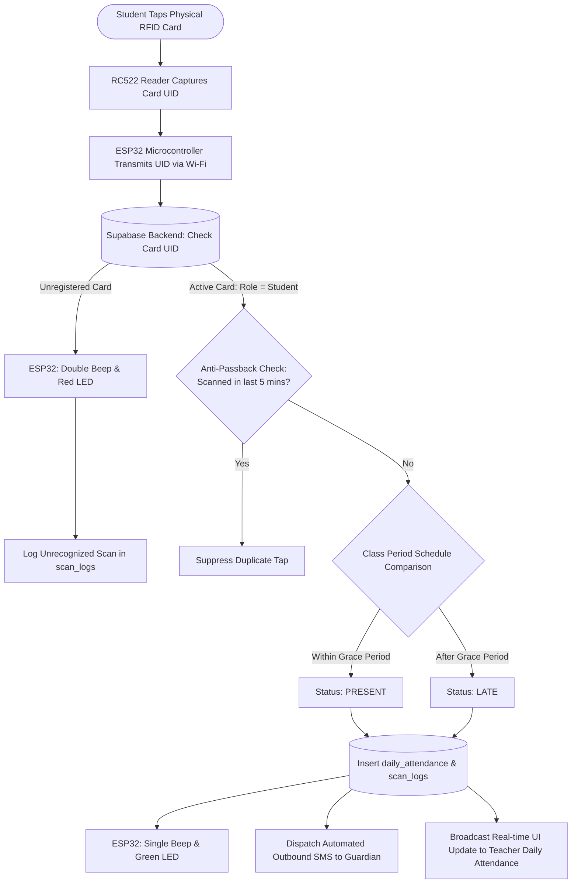
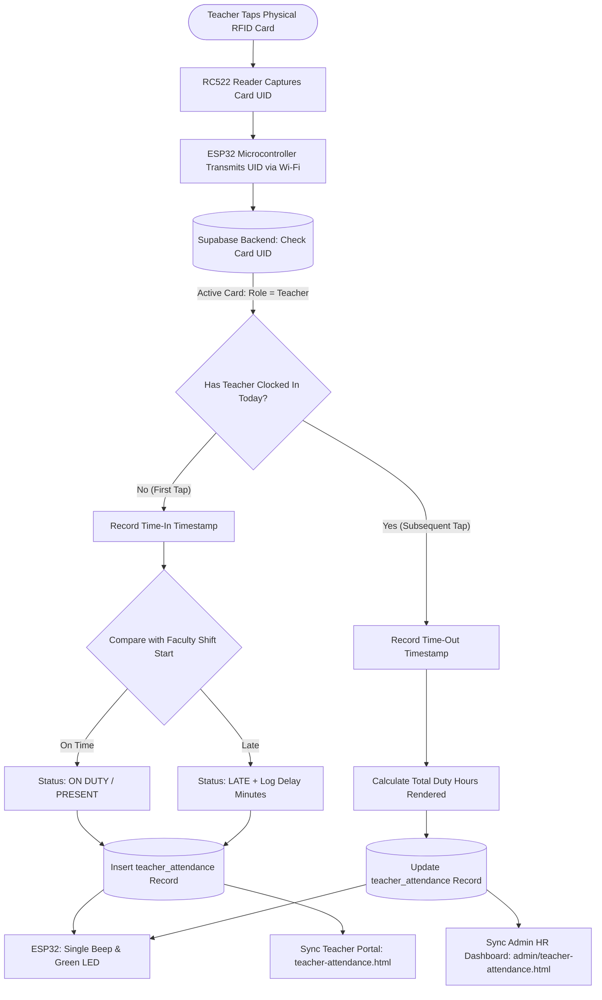
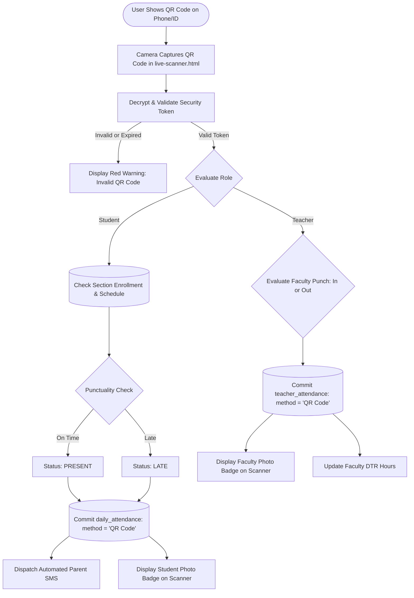

# BCP Attendance Monitoring System: RFID & QR Attendance Flow

**Capstone Title:** Design and Development of an Attendance Monitoring System for Bestlink College of the Philippines with Performance Analytics and RFID/QR Scanning  
**Document Purpose:** Complete technical and procedural documentation of the unified IoT RFID hardware tapping flow (ESP32 + RC522) and the software-based QR Code backup scanning flow for **both Student and Teacher roles**.

---

## 1. System Architecture Overview

The system implements a **unified, hybrid hardware-software architecture** designed specifically for real-world school environments. A single IoT hardware terminal dynamically processes attendance for **both students and teachers** based on database role detection:

* **Primary Method (IoT Hardware)**: **ESP32 Microcontroller + RC522 RFID Reader** connected via Wi-Fi for fast, physical card tapping.
* **Backup Method (Software QR Scanner)**: **Web-based Camera QR Scanner** (`live-scanner.html`) accessible via laptops, tablets, or smartphones when physical cards are forgotten or lost.

Both scanning methods commit to the same **Supabase PostgreSQL database**, trigger role-specific actions (**Parent SMS alerts** for students; **DTR duty hour tracking** for teachers), and synchronize with **real-time dashboards**.

```
   ┌───────────────────────────────────────────┐               ┌───────────────────────────────────────────┐
   │           PRIMARY: IoT HARDWARE           │               │          BACKUP: SOFTWARE SCANNER         │
   │  Student / Teacher Taps Physical RFID Card│               │ Student / Teacher Shows Personal QR Code  │
   └─────────────────────┬─────────────────────┘               └─────────────────────┬─────────────────────┘
                         │                                                           │
                         ▼                                                           ▼
                RC522 RFID Reader                                       Device Camera / Webcam
                         │                                                           │
                         ▼                                                           ▼
                    ESP32 Board                                     Web Application (`live-scanner.html`)
             (Sends HTTP POST via Wi-Fi)                                             │
                         │                                                           │
                         └─────────────────────────────┬─────────────────────────────┘
                                                       │
                                                       ▼
                                          [SUPABASE DATABASE / API]
                                     (Role Detection: Student vs Teacher)
                                                       │
                           ┌───────────────────────────┴───────────────────────────┐
                           ▼                                                       ▼
                   [ROLE: STUDENT]                                         [ROLE: TEACHER]
             - Class Schedule Verification                           - Shift Schedule Verification
             - Daily Roll Call Record                                - Daily Faculty DTR (Time-In / Time-Out)
             - Outbound SMS to Guardian                              - Duty Hours Rendered Calculation
             - Classroom Live Scanner Popup                          - Admin/HR Faculty Oversight Log
```

---

## 2. Primary Workflow: ESP32 + RC522 RFID Card Tapping

### 2.1 Hardware Stack
* **Microcontroller**: ESP32 (NodeMCU / DevKit with built-in Wi-Fi).
* **RFID Reader Module**: MFRC522 (RC522 13.56 MHz SPI Reader).
* **Tags**: Mifare Classic 1K RFID Cards / Keyfobs (encoded with distinct UIDs for Students and Teachers).
* **Feedback Indicators**: Active Buzzer (single beep on success, double beep on error) + Bi-color LED (Green: verified / Red: rejected).

### 2.2 Unified Hardware Transmission Payload
When a card is tapped, the ESP32 sends a lightweight JSON payload over Wi-Fi:
```json
{
  "device_id": "ESP32-AMS-01",
  "card_uid": "A34B129F",
  "timestamp": "2026-09-04T07:14:22Z"
}
```

---

### 2.3 Student Attendance Execution Flow
1. **Physical Card Tap**: Student taps their RFID card against the RC522 reader.
2. **Database Role Lookup**: Supabase checks the `rfid_cards` table and resolves the card owner to `role = 'student'`.
3. **Anti-Passback Check**: Verifies the student has not scanned within the last 5 minutes to prevent accidental duplicate taps.
4. **Punctuality Evaluation**: Compares arrival timestamp against the student's scheduled class period:
   - `Timestamp <= Start Time + Grace Period (15m)` $\rightarrow$ **Present (On Time)**
   - `Timestamp > Start Time + Grace Period` $\rightarrow$ **Late (Tardy)**
   - `No scan recorded during class window` $\rightarrow$ **Absent (Unexcused)**
5. **Data Storage**: Inserts record into `daily_attendance` (`method: 'RFID'`) and appends audit entry to `scan_logs`.
6. **Parent SMS Alert**: Automatically queues outbound SMS to the student's registered guardian (e.g., *"BCP AMS: Maria Santos arrived at 07:14 AM - Status: Present"*).
7. **UI Sync**: Broadcasts live WebSocket event to update the teacher's roll call sheet (`daily-attendance.html`) and live scanner screen (`live-scanner.html`).

#### Student RFID Mermaid Flowchart


---

### 2.4 Teacher Attendance Execution Flow
1. **Physical Card Tap**: Teacher taps their Faculty RFID card against the same ESP32 reader.
2. **Database Role Lookup**: Supabase checks `rfid_cards` and resolves the card owner to `role = 'teacher'`.
3. **Daily Punch Evaluation (Time-In vs. Time-Out)**:
   * **First Tap of the Day (Time-In)**:
     - Compares timestamp against faculty shift start time (e.g., `07:30 AM`).
     - Marks status as **On Duty / Present** (or **Late** if beyond shift grace period).
     - Inserts new row into `teacher_attendance` (`time_in`, `duty_status: 'On Duty'`).
   * **Subsequent Tap of the Day (Time-Out)**:
     - Updates the active row in `teacher_attendance` with `time_out`.
     - Automatically computes **Total Duty Hours Rendered** (e.g., `9.7 hrs`).
4. **Data Storage & Audit**: Inserts entry in `scan_logs` with `user_type: 'teacher'`.
5. **UI Sync**:
   * Updates teacher's personal portal (`teacher/teacher-attendance.html`) with real-time duty status.
   * Updates Admin faculty monitoring dashboard (`admin/teacher-attendance.html`) showing on-campus faculty count.

#### Teacher RFID Mermaid Flowchart


---

## 3. Backup Workflow: Web-Based Camera QR Code Scanning

### 3.1 Use Case Rationale (Why QR is the Backup)
* **Forgotten Physical Card**: If a student or teacher leaves their RFID card at home, they can present their dynamic digital QR code on their phone screen.
* **Hardware Offline / Power Interruption**: If the physical ESP32 terminal loses power or Wi-Fi, teachers can use their laptop webcam or phone camera as an immediate zero-cost backup scanner.
* **Zero Additional Classroom Cost**: Allows classroom roll call without requiring physical RFID hardware in every individual room.

### 3.2 Step-by-Step Execution Flow
1. **QR Code Generation**:
   * **Student**: Opens Student Portal on mobile to show personal QR badge containing encrypted user token (`StudentID + Hash + Expiry`).
   * **Teacher**: Opens Teacher Portal on mobile to show faculty QR badge for attendance/bundy clocking.
2. **Optical Scan Capture**: The scanner operator opens the **Live Scanner** (`live-scanner.html`) and points the camera at the QR code.
3. **Token Decryption & Validation**:
   * Frontend/backend validates token authenticity and expiration.
   * Resolves whether the user is a student or teacher.
4. **Attendance Processing**:
   * For **Students**: Verifies enrollment in the active subject section, evaluates punctuality, inserts into `daily_attendance` (`method: 'QR Code'`), and sends parent SMS.
   * For **Teachers**: Processes Time-In / Time-Out, updates `teacher_attendance` (`method: 'QR Code'`), and computes duty hours.
5. **Live Verification Card**: The scanner screen displays an instant verification card with photo, name, role badge, and status.

#### QR Code Scanning Mermaid Flowchart


---

## 4. Key Defense Points for Capstone Panelists

When explaining the system design to capstone panelists, use these structured points:

1. **Unified Dual-Role Hardware Architecture**:
   - *"We designed a single ESP32 + RC522 IoT station capable of dynamically processing both Student Classroom Attendance and Teacher Faculty DTR. The backend automatically identifies the role from the RFID UID and executes the appropriate business logic."*
2. **System Redundancy (Zero Single Point of Failure)**:
   - *"The system does not fail if a user forgets their physical card or if hardware loses power. The web-based QR scanner provides instant, zero-hardware redundancy using any device camera."*
3. **Automated Stakeholder Communication**:
   - *"Student card taps immediately trigger outbound SMS advisories to parents, bridging the communication gap between the school and guardians."*
4. **Cost-Effective Scalability**:
   - *"By utilizing ESP32 microcontrollers (~₱350–₱500) and web-based camera scanning, the institution eliminates the need for expensive commercial bundy turnstiles and proprietary kiosk machines."*
5. **Complete Audit Trail**:
   - *"Every transaction is transparently logged in `scan_logs` with timestamps, scan methods (`RFID` vs `QR Code`), and terminal identifiers for institutional integrity."*

---

## 5. Technology Comparison Matrix

| Aspect | Primary: ESP32 + RC522 RFID | Backup: Web Camera QR Code |
| :--- | :--- | :--- |
| **Medium** | Physical 13.56 MHz RFID Card / Keyfob | Screen Display on Phone or Printed ID |
| **Reader Device** | ESP32 Microcontroller + RC522 Module | Laptop WebCam, Tablet, or Smartphone |
| **Roles Supported** | **Both Students & Teachers** | **Both Students & Teachers** |
| **Communication** | Wi-Fi HTTP POST from ESP32 to Supabase | HTTPS Browser API via `live-scanner.html` |
| **Hardware Cost** | ~₱350 - ₱500 per IoT station | ₱0 (uses existing teacher/school device) |
| **Parent Alert (Student)** | Automated Outbound SMS via Gateway API | Automated Outbound SMS via Gateway API |
| **Faculty DTR (Teacher)** | Automated Time-In/Out & Duty Hours | Automated Time-In/Out & Duty Hours |
| **Database Tag** | `method: 'RFID'` | `method: 'QR Code'` |
