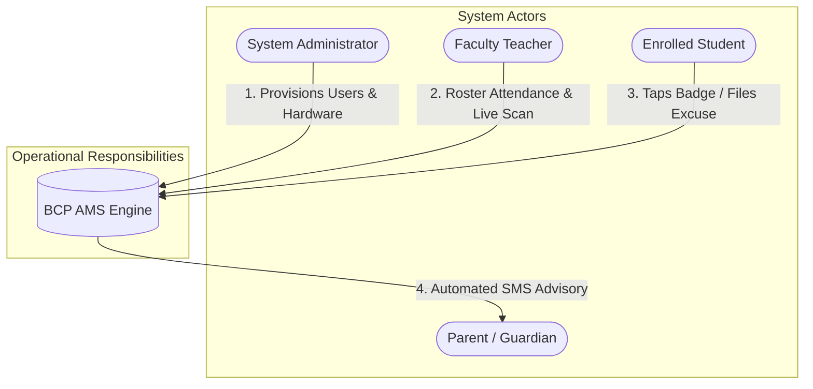
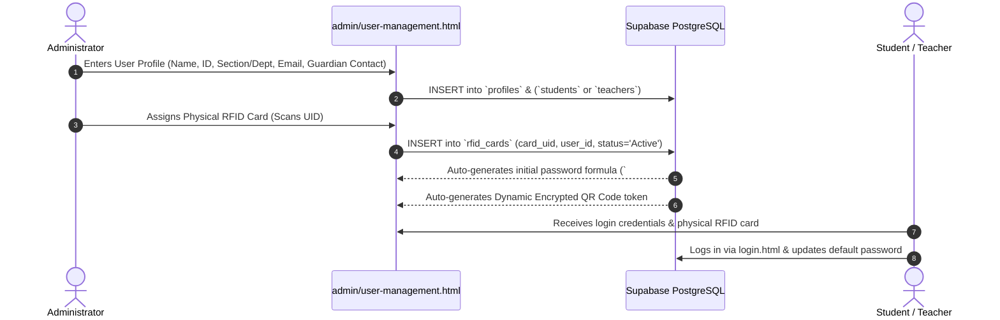
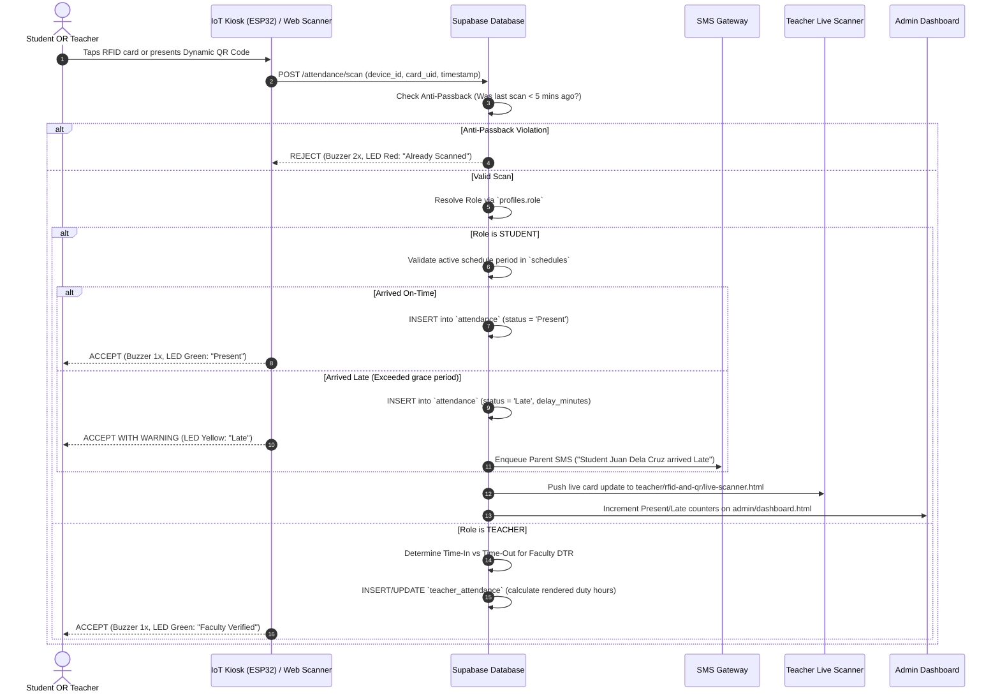
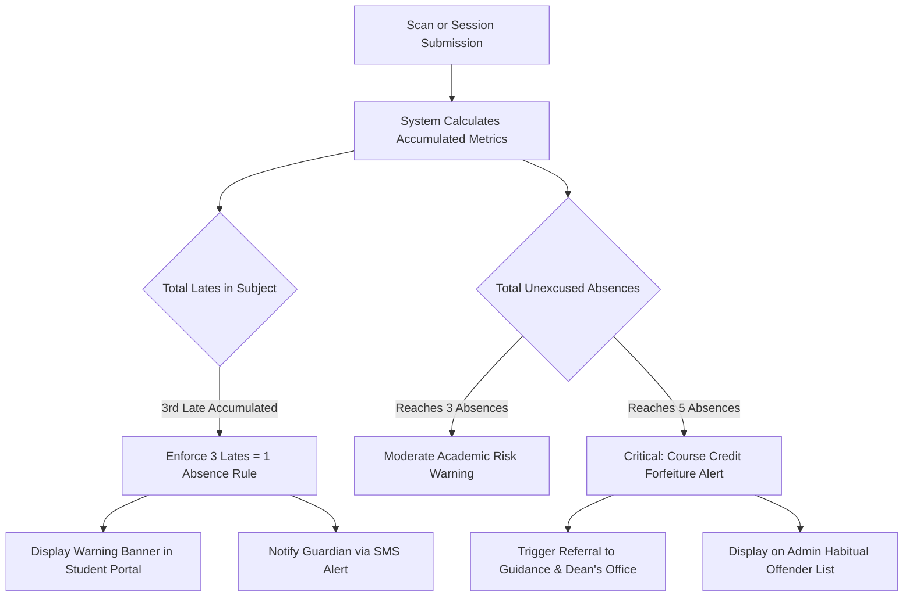
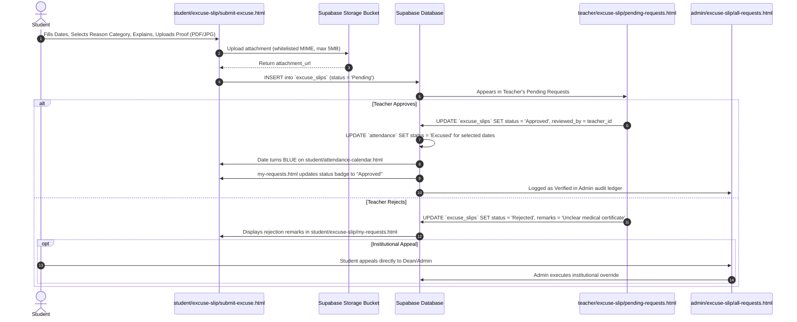
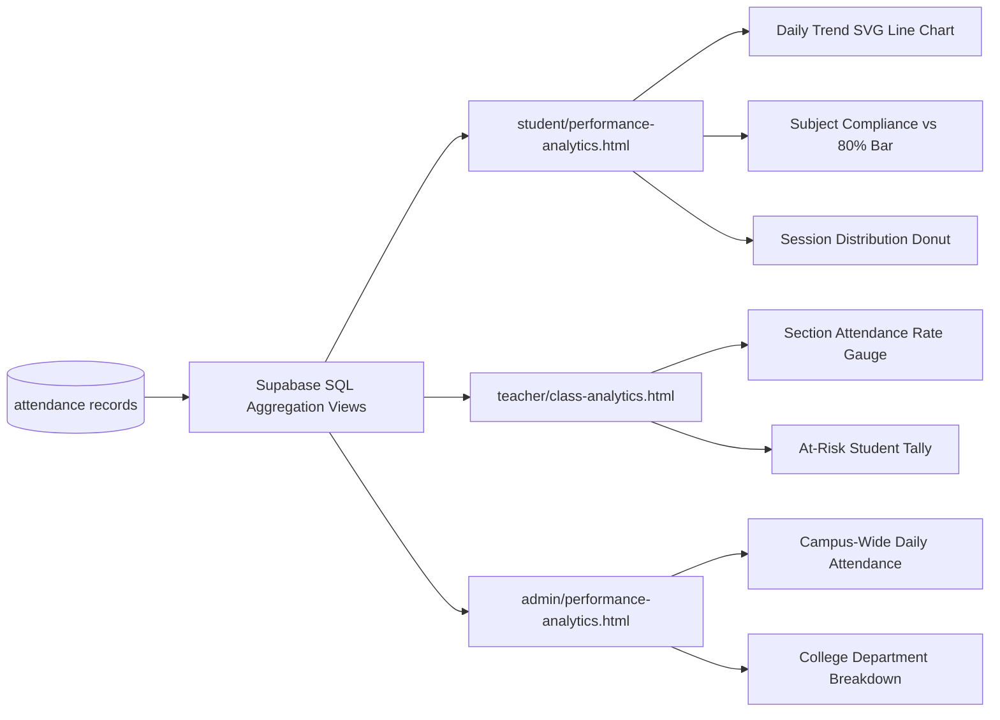
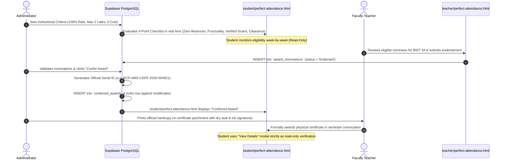

# End-to-End System Workflow Specification

## Project Title
**Design and Development of an Attendance Monitoring System for Bestlink College of the Philippines with Performance Analytics and RFID/QR Scanning (SMS1-AMS)**

* **Institution:** Bestlink College of the Philippines (BCP)
* **Program:** Bachelor of Science in Information Technology
* **Document Version:** 1.0.0
* **Document Purpose:** Complete academic and procedural workflow specification documenting the end-to-end data lifecycle connecting the **Administrator**, **Teacher**, and **Student** panels with IoT hardware scanners, automated parent SMS alerting, and Supabase PostgreSQL.

---

## 1. System Actors & Operational Responsibilities



| Actor | System Role & Authority | Primary Responsibilities |
| :--- | :--- | :--- |
| **Administrator** | Institutional Authority & Auditor | User provisioning, RFID card registration, campus-wide overrides, calendar configuration, academic term management, system security audits, and official award conferment. |
| **Faculty Teacher** | Classroom Evaluator & First-Line Reviewer | Daily class attendance recording, classroom live kiosk scanning, first-line review of excuse slips, section punctuality tracking, and nominating students for academic honors. |
| **Enrolled Student** | Credential Holder & Viewer (Read-Only) | Identity badge tapping (RFID), backup QR display, viewing personal attendance records and calendar, submitting excuse slips with proof, and tracking award eligibility. |
| **Parent / Guardian** | External Notification Recipient | Receiving automated real-time SMS alerts regarding late arrivals, cuts, or chronic absence thresholds. |

---

## 2. High-Level End-to-End Architecture

```mermaid
flowchart TD
    subgraph HardwareLayer [Hardware & Client Layer]
        ESP32[ESP32 + RC522 RFID Kiosk]
        WebCam[Webcam / Phone QR Scanner]
        WebUI[Responsive Web Application]
    end

    subgraph IngestionLayer [Ingestion & Processing]
        API[Supabase Edge / PostgREST APIs]
        AuthEngine[Supabase Auth & Session Guard]
        AntiPassback[Anti-Passback 5-min Cooldown]
    end

    subgraph StorageLayer [Database & Storage (Supabase)]
        DB_Profiles[(profiles / students / teachers)]
        DB_Attendance[(attendance / teacher_attendance)]
        DB_Excuses[(excuse_slips & storage bucket)]
        DB_Audit[(user_activity & sms_logs)]
    end

    subgraph MultiPanelSync [Real-Time Cross-Panel Reflection]
        AdminPanel[Admin Dashboard & Ledger]
        TeacherPanel[Teacher Roster & Scanner]
        StudentPanel[Student Ledger, Calendar & Notifications]
        SMSGateway[Outbound SMS Gateway]
    end

    ESP32 -->|Wi-Fi HTTP POST| API
    WebCam -->|Camera Capture| WebUI
    WebUI -->|Authenticated REST / Bearer JWT| API
    API --> AuthEngine
    AuthEngine --> AntiPassback
    AntiPassback --> StorageLayer

    StorageLayer --> AdminPanel
    StorageLayer --> TeacherPanel
    StorageLayer --> StudentPanel
    StorageLayer --> SMSGateway
```

---

## 3. Detailed Step-by-Step Workflows

### 3.1 Lifecycle 1: User Provisioning & Credential Enrollment



1. **Profile Creation:** Admin registers new students or teachers.
2. **Credential Assignment:** The admin registers a Mifare 1K RFID card UID into `rfid_cards` mapped to the user.
3. **Dynamic QR Generation:** The system binds an encrypted dynamic token containing `user_id + timestamp + salt` accessible on the student's mobile portal.
4. **Security Notice:** Plain-text passwords are never stored; Supabase Auth hashes credentials using salted Bcrypt.

---

### 3.2 Lifecycle 2: Contactless Attendance Capture & Role Resolution



---

### 3.3 Lifecycle 3: Classroom Daily Attendance & Session Finalization

```mermaid
sequenceDiagram
    autonumber
    actor Teacher as Faculty Teacher
    participant UI as teacher/daily-attendance.html
    participant DB as Supabase PostgreSQL
    participant StudentUI as Student Portal
    participant AdminUI as Admin Portal

    Teacher->>UI: Selects Subject (e.g. IT301), Section (BSIT 3A), & Date
    UI->>DB: Fetch Enrolled Students & Pre-populated Kiosk Scans
    DB-->>UI: Displays Roster with real-time status badges
    Teacher->>UI: Performs manual adjustments if needed (e.g. Mark Excused / Absent)
    alt Save Local Draft
        Teacher->>UI: Clicks "Save Draft" (stored locally without final admin lock)
    else Submit to Administration
        Teacher->>UI: Clicks "Submit Attendance to Admin"
        UI->>DB: UPDATE `attendance` SET is_locked = true, verified_by = teacher_id
        DB->>AdminUI: Attendance locked; reflects in admin/attendance.html audit trail
        DB->>StudentUI: Instantly reflects in student/my-attendance.html & Calendar
    end
```

---

### 3.4 Lifecycle 4: Tardy & Absence Policy Threshold Monitoring



1. **Automated Tallying:** Each late entry adds exact delay minutes and increments subject frequency counters.
2. **The 3-Late Rule:** On the 3rd tardy, the system flags an equivalent unexcused absence penalty, notifying the parent via SMS and rendering a warning banner on `student/tardy-and-absence/tardy-records.html`.
3. **Credit Risk Cap:** Reaching 5 unexcused absences triggers an immediate Dean/Guidance review advisory on `admin/tardy-and-absence/absence-list.html`.

---

### 3.5 Lifecycle 5: Multi-Tier Excuse Slip Processing



---

### 3.6 Lifecycle 6: Faculty Attendance (DTR) & Duty Hours

1. **Morning Punch-In:** Faculty teacher taps their registered RFID badge at the kiosk.
2. **Duty Verification:** The system confirms faculty status, sets `teacher_attendance.time_in`, and records `status = 'Present'`.
3. **Evening Punch-Out:** Faculty teacher taps again upon shift conclusion; the system sets `teacher_attendance.time_out` and automatically computes `rendered_hours`.
4. **Administrative Oversight:** Human Resources and Administrators view monthly DTR logs, overtime hours, and tardiness tallies on `admin/teacher-attendance.html`.
5. **Role Boundary:** Students have **zero visibility** into faculty DTR records.

---

### 3.7 Lifecycle 7: Performance Analytics & Visual Reporting



---

### 3.8 Lifecycle 8: Perfect Attendance Award Nomination & Conferment



---

## 4. Cross-Panel State Synchronization Rules

To prevent data desynchronization, the system follows these strict transactional rules:

| Trigger Event | Immediate Primary Mutation | Secondary Cascading State Updates |
| :--- | :--- | :--- |
| **Kiosk Scan (Late)** | `INSERT` into `attendance` (`status = 'Late'`) | 1. Increment Student late count.<br>2. Queue Parent SMS.<br>3. Push WebSocket event to Teacher Live Scanner.<br>4. Increment Admin dashboard counter. |
| **Excuse Slip Approved** | `UPDATE excuse_slips` (`status = 'Approved'`) | 1. Mutate `attendance.status` from `Absent` to `Excused`.<br>2. Turn Calendar date badge **Blue**.<br>3. Deduct from unexcused absence total.<br>4. Re-validate Perfect Attendance Award eligibility. |
| **Session Locked by Teacher** | `UPDATE attendance` (`is_locked = true`) | 1. Disable teacher roster edit controls.<br>2. Reflect finalized attendance in student ledger.<br>3. Write entry to `user_activity` audit trail. |
| **Concurrent Login Detected** | `UPDATE profiles.active_session_id` | Terminate session on any other device holding an outdated token hash. |

---

## 5. Security & Technical Constraints Checklist

Before moving any module into production:
- [x] **Universal Session Guard:** Missing JWT redirects to `/login.html?reason=unauthorized`.
- [x] **Anti-Passback Cooldown:** Rejects taps within 5 minutes for the same identity.
- [x] **Row Level Security:** 100% of tables enforced with PostgreSQL RLS policies.
- [x] **No Self-Service Printing:** Students cannot generate, print, or download certificates.
- [x] **Anti-XSS:** All dynamic DOM injections use `textContent` or sanitized nodes.
- [x] **Secret Key Isolation:** `service_role` key strictly excluded from frontend code.
- [x] **Audit Trail:** Critical mutations logged immutably in `user_activity`.
