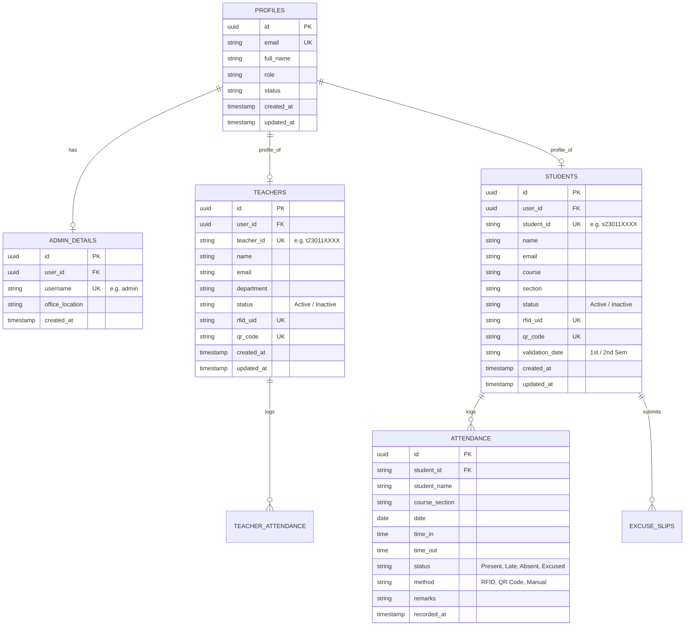

# Database Schema Design – Bestlink College of the Philippines Attendance Monitoring System

## Overview
This document defines the relational database schema design for the Attendance Monitoring System powered by **Supabase (PostgreSQL)** with Role-Based Access Control (RBAC) for **Admin**, **Teacher**, and **Student** roles.

The schema is structured to ensure:
- **No Key Conflicts:** Standardized naming conventions across primary keys (`id`), foreign keys (`user_id`, `student_id`, `teacher_id`), and unique identifiers (`email`, `rfid_uid`, `qr_code`).
- **Data Integrity:** Referential integrity with cascading rules where appropriate.
- **Auditing & Tracking:** Timestamp columns (`created_at`, `updated_at`, `recorded_at`).
- **Security:** PostgreSQL Row-Level Security (RLS) policies enforcing role authorization.

---

## Entity Relationship Summary

---

## Detailed Table Specifications

### 1. `profiles` Table
Central table mapping to Supabase Auth `auth.users`.
| Column | Type | Constraints | Description |
|---|---|---|---|
| `id` | `UUID` | `PRIMARY KEY`, references `auth.users(id) ON DELETE CASCADE` | Supabase auth user identifier |
| `email` | `TEXT` | `UNIQUE NOT NULL` | Login email / Gmail address |
| `full_name` | `TEXT` | `NOT NULL` | Full Name (Last, First Middle) |
| `role` | `TEXT` | `NOT NULL CHECK (role IN ('admin', 'teacher', 'student'))` | Assigned system role |
| `status` | `TEXT` | `DEFAULT 'Active' CHECK (status IN ('Active', 'Inactive', 'Archived'))` | Account status |
| `created_at` | `TIMESTAMPTZ` | `DEFAULT timezone('utc'::text, now())` | Record creation timestamp |
| `updated_at` | `TIMESTAMPTZ` | `DEFAULT timezone('utc'::text, now())` | Last update timestamp |

### 2. `students` Table
Stores student enrollment data, automatic IDs, RFID credentials, and validation info.
| Column | Type | Constraints | Description |
|---|---|---|---|
| `id` | `UUID` | `PRIMARY KEY DEFAULT gen_random_uuid()` | Internal table ID |
| `user_id` | `UUID` | `REFERENCES profiles(id) ON DELETE CASCADE` | Associated profile account |
| `student_id` | `TEXT` | `UNIQUE NOT NULL` | Generated Student No. (e.g. `s230111001`) |
| `name` | `TEXT` | `NOT NULL` | Full name of the student |
| `email` | `TEXT` | `NOT NULL` | Student Gmail (for notifications & portal login) |
| `course` | `TEXT` | `NOT NULL` | Academic course (e.g. `BSIT`, `BSCS`, `BSBA`) |
| `section` | `TEXT` | `NOT NULL` | Auto-assigned section (e.g. `2A`, `1B`), editable by admin |
| `status` | `TEXT` | `DEFAULT 'Active'` | Status (`Active`, `Inactive`) |
| `rfid_uid` | `TEXT` | `UNIQUE` | Contactless RFID Card Hex / UID |
| `qr_code` | `TEXT` | `UNIQUE` | Generated QR code payload string |
| `validation_date` | `TEXT` | `NOT NULL` | Academic term (e.g. `1st Semester`, `2nd Semester`) |
| `created_at` | `TIMESTAMPTZ` | `DEFAULT timezone('utc'::text, now())` | Created timestamp |
| `updated_at` | `TIMESTAMPTZ` | `DEFAULT timezone('utc'::text, now())` | Updated timestamp |

### 3. `teachers` Table
Stores faculty member accounts, departments, and scanning badges.
| Column | Type | Constraints | Description |
|---|---|---|---|
| `id` | `UUID` | `PRIMARY KEY DEFAULT gen_random_uuid()` | Internal table ID |
| `user_id` | `UUID` | `REFERENCES profiles(id) ON DELETE CASCADE` | Associated profile account |
| `teacher_id` | `TEXT` | `UNIQUE NOT NULL` | Generated Teacher No. (e.g. `t230111001`) |
| `name` | `TEXT` | `NOT NULL` | Full name of the teacher |
| `email` | `TEXT` | `NOT NULL` | Teacher Gmail (for notifications & portal login) |
| `department` | `TEXT` | `NOT NULL` | Department / College selection |
| `status` | `TEXT` | `DEFAULT 'Active'` | Status (`Active`, `Inactive`) |
| `rfid_uid` | `TEXT` | `UNIQUE` | Contactless RFID Card UID |
| `qr_code` | `TEXT` | `UNIQUE` | Generated QR code badge string |
| `created_at` | `TIMESTAMPTZ` | `DEFAULT timezone('utc'::text, now())` | Created timestamp |
| `updated_at` | `TIMESTAMPTZ` | `DEFAULT timezone('utc'::text, now())` | Updated timestamp |

### 4. `admin_details` Table
Stores administrator credentials and settings.
| Column | Type | Constraints | Description |
|---|---|---|---|
| `id` | `UUID` | `PRIMARY KEY DEFAULT gen_random_uuid()` | Internal table ID |
| `user_id` | `UUID` | `REFERENCES profiles(id) ON DELETE CASCADE` | Associated profile account |
| `username` | `TEXT` | `UNIQUE NOT NULL DEFAULT 'admin'` | Admin username (fixed `admin`) |
| `office_location` | `TEXT` | `DEFAULT 'Main Administration Office'` | Administrative office |
| `created_at` | `TIMESTAMPTZ` | `DEFAULT timezone('utc'::text, now())` | Created timestamp |

### 5. `attendance` Table
Logs student scans and daily class attendance.
| Column | Type | Constraints | Description |
|---|---|---|---|
| `id` | `UUID` | `PRIMARY KEY DEFAULT gen_random_uuid()` | Unique log ID |
| `student_id` | `TEXT` | `NOT NULL` | Reference to `students.student_id` |
| `student_name` | `TEXT` | `NOT NULL` | Name of the student at the time of log |
| `course_section` | `TEXT` | `NOT NULL` | Course and section (e.g. `BSIT 2A`) |
| `date` | `DATE` | `NOT NULL DEFAULT CURRENT_DATE` | Date of attendance |
| `time_in` | `TIME` | `NULL` | Scanned time in |
| `time_out` | `TIME` | `NULL` | Scanned time out |
| `status` | `TEXT` | `NOT NULL CHECK (status IN ('Present', 'Late', 'Absent', 'Excused'))` | Attendance status |
| `method` | `TEXT` | `DEFAULT 'RFID' CHECK (method IN ('RFID', 'QR Code', 'Manual'))` | Scan method |
| `remarks` | `TEXT` | `DEFAULT '-'` | Lateness or absence remarks |
| `recorded_at` | `TIMESTAMPTZ` | `DEFAULT timezone('utc'::text, now())` | Timestamp of log |

---

## Row-Level Security (RLS) Policy Rules

1. **`profiles` Policies**:
   - `admin_all_profiles`: Admins have full access (`SELECT`, `INSERT`, `UPDATE`, `DELETE`) to all profiles.
   - `users_view_own_profile`: Users can read their own profile row (`auth.uid() = id`).
   - `users_update_own_profile`: Users can update non-critical profile fields.

2. **`students` Policies**:
   - `admin_manage_students`: Admins can perform `ALL` operations.
   - `teacher_view_students`: Teachers can view (`SELECT`) enrolled students.
   - `student_view_own_data`: Students can read (`SELECT`) their own student row (`user_id = auth.uid()`).

3. **`teachers` Policies**:
   - `admin_manage_teachers`: Admins can perform `ALL` operations.
   - `teacher_view_teachers`: Teachers can view faculty member profiles.

4. **`attendance` Policies**:
   - `admin_manage_attendance`: Admins can read and write all attendance logs.
   - `teacher_record_attendance`: Teachers can insert and update student attendance logs.
   - `student_view_own_attendance`: Students can only read (`SELECT`) their own attendance logs matching their `student_id`.

---

## Initial 1 Account per Role (Admin, Teacher, Student)

### 1. Admin Account (1 Account)
- **Username / Login:** `admin`
- **Email:** `admin@bcp.edu.ph` (or `jaynzxc.devs@gmail.com`)
- **Initial Password:** `bcpadmin123` *(Reserved strictly for Admin role)*
- **Role:** `admin`

### 2. Teacher Account (1 Account)
- **Teacher ID:** `t230111001`
- **Full Name:** `Prof. Robert Miller`
- **Email / Gmail:** `teacher@gmail.com`
- **Initial Password:** `teacher123` *(Customizable by Admin in User Management)*
- **Department:** `College of Computer Studies`
- **RFID Card UID:** `E20000192900001`
- **QR Code:** `QR-TCH-t230111001`
- **Role:** `teacher`

### 3. Student Account (1 Account)
- **Student ID:** `s230111001`
- **Full Name:** `Dela Cruz, Juan Paolo`
- **Email / Gmail:** `student@gmail.com`
- **Initial Password:** `student123` *(Customizable by Admin in User Management)*
- **Course & Section:** `BSIT 2A`
- **Validation Date:** `1st Semester`
- **RFID Card UID:** `E20000192803001`
- **QR Code:** `QR-STU-s230111001`
- **Role:** `student`
