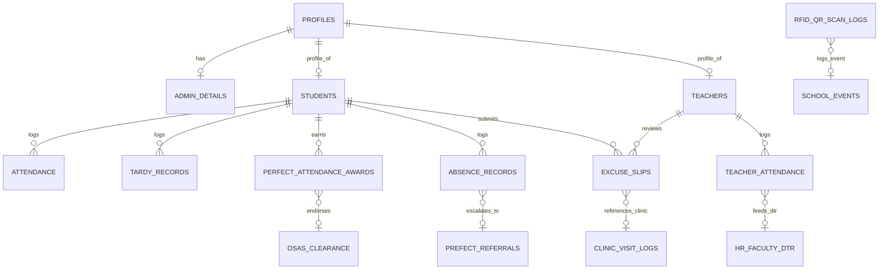

# Database Schema Design – Bestlink College of the Philippines Attendance Monitoring System

## Overview
This document defines the relational database schema design for the **Attendance Monitoring System (AMS)** powered by **Supabase (PostgreSQL)** with Role-Based Access Control (RBAC) for **Admin**, **Teacher**, and **Student** roles, including data bridge contracts for integration with the **SMS 1 Master Architecture**.

---

## 1. Entity Relationship Diagram (AMS Core & SMS 1 Bridges)

---

## 2. Table Specifications

### 2.1 Core Master Tables

#### `profiles` Table
Maps directly to Supabase Auth `auth.users.id`.
| Column | Type | Constraints | Description |
|---|---|---|---|
| `id` | `UUID` | `PRIMARY KEY`, references `auth.users(id) ON DELETE CASCADE` | Auth user identifier |
| `email` | `TEXT` | `UNIQUE NOT NULL` | Institutional email / login |
| `full_name` | `TEXT` | `NOT NULL` | Full Name (Last, First Middle) |
| `role` | `TEXT` | `NOT NULL CHECK (role IN ('admin', 'teacher', 'student'))` | Primary role |
| `status` | `TEXT` | `DEFAULT 'Active' CHECK (status IN ('Active', 'Inactive', 'Archived'))` | Account status |
| `created_at` | `TIMESTAMPTZ` | `DEFAULT timezone('utc'::text, now())` | Record creation timestamp |
| `updated_at` | `TIMESTAMPTZ` | `DEFAULT timezone('utc'::text, now())` | Last update timestamp |

#### `students` Table
| Column | Type | Constraints | Description |
|---|---|---|---|
| `id` | `UUID` | `PRIMARY KEY DEFAULT gen_random_uuid()` | Internal ID |
| `user_id` | `UUID` | `REFERENCES profiles(id) ON DELETE CASCADE` | Associated profile |
| `student_id` | `TEXT` | `UNIQUE NOT NULL` | Student Number (e.g. `s230111001`) |
| `name` | `TEXT` | `NOT NULL` | Full name |
| `email` | `TEXT` | `NOT NULL` | Student email |
| `course` | `TEXT` | `NOT NULL` | Degree program (e.g. `BSIT`, `BSCS`) |
| `section` | `TEXT` | `NOT NULL` | Assigned section (e.g. `3A`) |
| `rfid_uid` | `TEXT` | `UNIQUE` | Physical RFID hex UID |
| `qr_code` | `TEXT` | `UNIQUE` | Encrypted dynamic QR pass |
| `status` | `TEXT` | `DEFAULT 'Active'` | Status |

#### `teachers` Table
| Column | Type | Constraints | Description |
|---|---|---|---|
| `id` | `UUID` | `PRIMARY KEY DEFAULT gen_random_uuid()` | Internal ID |
| `user_id` | `UUID` | `REFERENCES profiles(id) ON DELETE CASCADE` | Associated profile |
| `teacher_id` | `TEXT` | `UNIQUE NOT NULL` | Faculty ID (e.g. `t230111001`) |
| `name` | `TEXT` | `NOT NULL` | Full name |
| `email` | `TEXT` | `NOT NULL` | Faculty email |
| `department` | `TEXT` | `NOT NULL` | Academic department |
| `rfid_uid` | `TEXT` | `UNIQUE` | Physical RFID card UID |
| `status` | `TEXT` | `DEFAULT 'Active'` | Status |

---

### 2.2 Attendance & Tracking Tables

#### `attendance` Table (Daily Classroom Roster)
| Column | Type | Constraints | Description |
|---|---|---|---|
| `id` | `UUID` | `PRIMARY KEY DEFAULT gen_random_uuid()` | Log ID |
| `student_id` | `TEXT` | `NOT NULL` | References `students.student_id` |
| `student_name` | `TEXT` | `NOT NULL` | Student name at time of log |
| `course_section` | `TEXT` | `NOT NULL` | Course and section |
| `subject_code` | `TEXT` | `NOT NULL` | Subject code (e.g. `IT301`) |
| `date` | `DATE` | `NOT NULL DEFAULT CURRENT_DATE` | Attendance date |
| `time_in` | `TIME` | `NULL` | Scan arrival time |
| `time_out` | `TIME` | `NULL` | Scan dismissal time |
| `status` | `TEXT` | `CHECK (status IN ('Present', 'Late', 'Absent', 'Excused'))` | Daily status |
| `method` | `TEXT` | `CHECK (method IN ('RFID', 'QR Code', 'Manual'))` | Ingestion method |
| `remarks` | `TEXT` | `DEFAULT '-'` | Attendance remarks |

#### `teacher_attendance` Table (Faculty Gate & DTR)
| Column | Type | Constraints | Description |
|---|---|---|---|
| `id` | `UUID` | `PRIMARY KEY DEFAULT gen_random_uuid()` | DTR log ID |
| `teacher_id` | `TEXT` | `NOT NULL` | References `teachers.teacher_id` |
| `employee_id` | `TEXT` | `NULL` | SMS 1 HR Employee ID |
| `date` | `DATE` | `NOT NULL DEFAULT CURRENT_DATE` | Duty date |
| `time_in` | `TIME` | `NULL` | Gate entry time |
| `time_out` | `TIME` | `NULL` | Gate exit time |
| `rendered_hours` | `DECIMAL(4,2)` | `DEFAULT 0.00` | Calculated duty hours |
| `status` | `TEXT` | `CHECK (status IN ('Present', 'Late', 'Absent', 'On Leave'))` | Punctuality status |
| `hr_leave_id` | `UUID` | `NULL` | References SMS 1 HR approved leave |
| `hr_sync_status` | `TEXT` | `DEFAULT 'SYNCED'` | Sync status to HR module |

#### `excuse_slips` Table (Dual-Option Support)
| Column | Type | Constraints | Description |
|---|---|---|---|
| `id` | `UUID` | `PRIMARY KEY DEFAULT gen_random_uuid()` | Slip ID |
| `student_id` | `TEXT` | `NOT NULL` | Student identifier |
| `absence_date` | `DATE` | `NOT NULL` | Target date of absence |
| `reason_category` | `TEXT` | `NOT NULL` | Reason category |
| `medical_source` | `TEXT` | `CHECK (medical_source IN ('EXTERNAL_MEDICAL', 'CLINIC_PASS', 'NON_MEDICAL'))` | Medical origin |
| `clinic_pass_number` | `TEXT` | `NULL` | On-campus clinic pass ID |
| `clinic_visit_id` | `UUID` | `NULL` | References SMS 1 Clinic visit log |
| `clinic_verification_status` | `TEXT` | `DEFAULT 'NOT_APPLICABLE'` | Clinic check status |
| `document_url` | `TEXT` | `NULL` | External medical cert file link |
| `status` | `TEXT` | `DEFAULT 'Pending' CHECK (status IN ('Pending', 'Approved', 'Rejected'))` | Decision status |

#### `absence_records` & `tardy_records` (Truancy Escalation)
* Both tables maintain `is_habitual_truancy BOOLEAN DEFAULT false` and `prefect_referral_id UUID` to bridge chronic truancy records directly to the PREFECT Disciplinary Action Module.

#### `perfect_attendance_awards` Table
* Contains `osas_endorsement_status VARCHAR(20) DEFAULT 'PENDING_OSAS'` and `certificate_serial_hash VARCHAR(64) UNIQUE` linking qualifying candidates to the OSAS Honors & Clearance Module.

#### `rfid_qr_scan_logs` Table
* Contains `event_id UUID` and `scan_context VARCHAR(30) DEFAULT 'CLASSROOM_PERIOD'` (`GATE_ENTRY`, `CLASSROOM_PERIOD`, `EVENT_VENUE`) to bridge kiosk scans to School Events.

---

## 3. Row-Level Security (RLS) Policy Rules

1. **`attendance` Table**:
   * `admin_manage_attendance`: Full `ALL` read/write and administrative override.
   * `teacher_record_attendance`: `SELECT`, `INSERT`, `UPDATE` for assigned subject sections.
   * `student_view_own_attendance`: `SELECT` only where `student_id` matches current authenticated student.
2. **`teacher_attendance` Table**:
   * `admin_manage_faculty_dtr`: Full `ALL` oversight.
   * `teacher_view_own_dtr`: `SELECT` only where `teacher_id` matches authenticated faculty.
   * Students have strictly zero access (`NO ACCESS`).
3. **`excuse_slips` Table**:
   * `student_manage_slips`: `SELECT`, `INSERT` own submissions.
   * `teacher_review_slips`: `SELECT`, `UPDATE` (approve/reject) for assigned classes.
   * `admin_audit_slips`: Full `ALL` for final institutional appeals.
